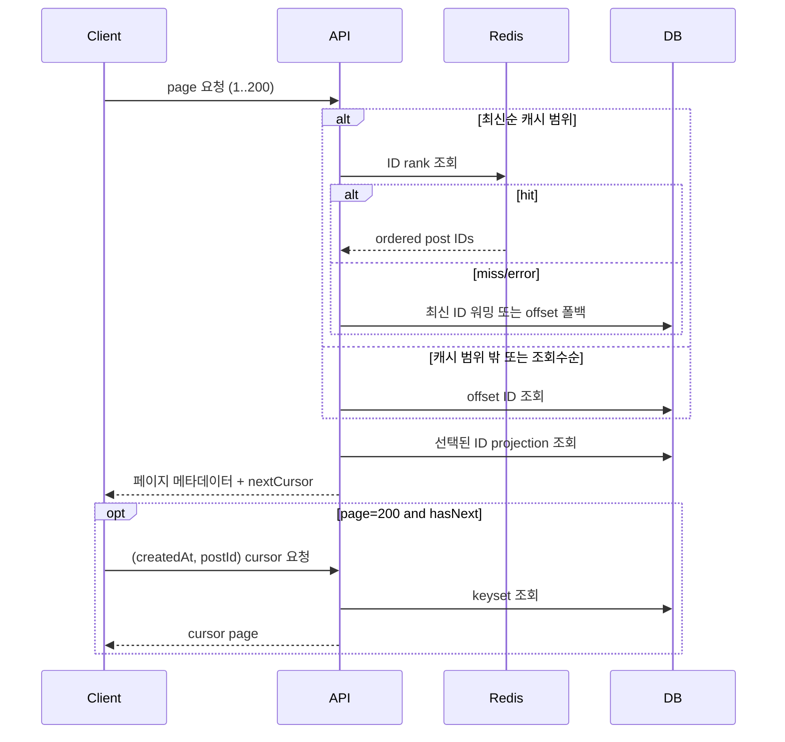

# 게시글 목록 페이지네이션

## 요구사항

- 페이지 번호 탐색은 1~200페이지만 제공한다.
- 최신순 앞쪽 목록은 게시판·카테고리별 Redis Sorted Set에서 ID를 조회한다.
- 캐시 범위를 벗어난 200페이지 이내 요청은 DB offset 조회를 사용한다.
- 200페이지에서 더 오래된 글이 있으면 응답의 `nextCursor`로 커서 조회를 이어간다.
- Redis 장애가 게시글 목록 조회나 쓰기를 실패시키지 않아야 한다.

## 구현된 흐름

Redis에는 `createdAt`의 epoch millisecond를 score로, 19자리로 0-padding한 `postId`를 member로 저장한다. 같은 score에서는 member 역순이 `post_id DESC`와 일치한다. 현재 epoch millisecond는 Redis double의 정확한 정수 범위인 `±2^53` 안에 있다.

게시글 생성·수정·삭제는 트랜잭션 커밋 뒤 해당 게시판의 전체·카테고리 캐시를 무효화한다. 무효화 실패는 쓰기 결과를 되돌리지 않고 3분 TTL 만료로 복구한다. 캐시 워밍과 쓰기가 겹치면 version 비교로 오래된 스냅숏 저장을 거부한다.

## 결정과 제한

- 기본 `size=20`에서 캐시는 최신 201개 ID, 즉 1~10페이지와 `hasNext` 판정 1건을 담당한다.
- 커서 handoff는 `(createdAt, postId)` 정렬이 동일한 `LATEST`에만 제공한다. `VIEW_COUNT`는 200페이지 상한 안에서만 조회한다.
- DB가 `DATETIME(6)` 이상으로 바뀌면 millisecond 변환이 세부 정밀도를 자르므로 score 인코딩과 정렬 테스트를 함께 변경해야 한다.
